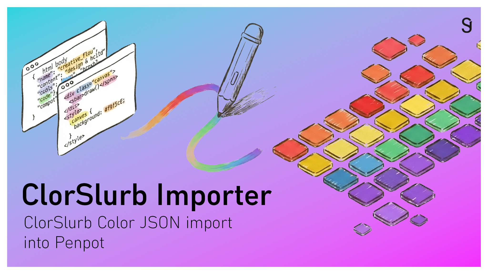

# ColorSlurp Importer for Penpot



[](https://github.com/janstieler/penpot-colorslurp-importer/blob/main/README.de.md)

Bring your color palettes from [ColorSlurp](https://colorslurp.com) into [Penpot](https://penpot.app) in seconds. Export your palette as JSON in ColorSlurp, paste or drop it into the plugin, pick the colors you want — and import them directly into your local color library.

## Features

- Paste or drop a ColorSlurp JSON export into the plugin
- Preview all colors as swatches before importing
- Duplicate detection — already imported colors are marked and deselected automatically
- Selectable swatches — choose exactly which colors to import
- Optional numbered prefix to preserve the original palette order (e.g. `01_Sky`, `02_Ocean`)
- Light and dark theme, follows Penpot's UI setting
- No external dependencies at runtime

## Installation

1. Open any file in Penpot
2. Press `Ctrl + Alt + P` to open the Plugin Manager
3. Enter the manifest URL:
   ```
   https://webdev.kdjfs.de/colorslurp-importer/manifest.json
   ```
4. Click **Install** — the plugin is now available in Penpot

## Usage

### 1. Export from ColorSlurp

In ColorSlurp, open your palette and export it as **JSON**. The file looks like this:

```json
{
  "name": "My Palette",
  "colors": [
    { "name": "Sky", "hex": "#87CEEB", "alpha": 1 },
    { "name": "Ocean", "hex": "#006994", "alpha": 1 }
  ]
}
```

### 2. Import into Penpot

1. Open the plugin in Penpot
2. Paste the JSON or drag and drop the `.json` file into the text area
3. Click **Next →** to see the color swatches
4. Colors already present in your library are greyed out and deselected
5. Optionally enable **numbered prefix** to keep the palette order intact in Penpot
6. Select the colors you want and click **Import**

## Development

### Requirements

- Node.js 18+
- npm

### Setup

```bash
git clone https://github.com/janstieler/penpot-colorslurp-importer
cd penpot-colorslurp-importer
npm install
```

### Dev server

```bash
npm run dev
```

The plugin UI is served at `http://localhost:4400`. Load it in Penpot via:
```
http://localhost:4400/manifest.json
```

### Build

```bash
npm run build
```

Output goes to `dist/`.

### Self-hosting

Deploy the contents of `dist/` to any static web server. Update `host` in `public/manifest.json` and `penpot.ui.open(...)` in `src/plugin.ts` to match your domain, then rebuild.

## Permissions

The plugin requests the following Penpot permissions:

| Permission | Reason |
|---|---|
| `library:read` | Check for already imported colors |
| `library:write` | Add new colors to the local library |
| `user:read` | Read the current UI theme |

## License

MIT — © 2026 [Jan-Frederik Stieler](https://www.janstieler.de)
